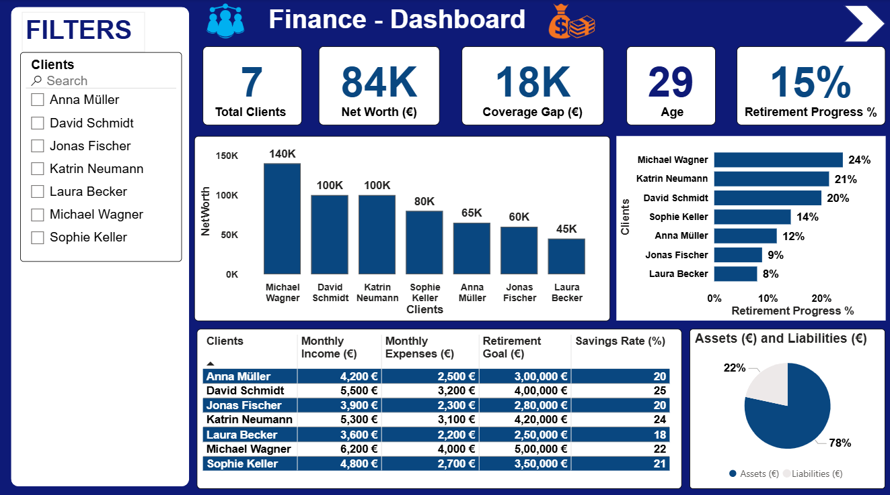
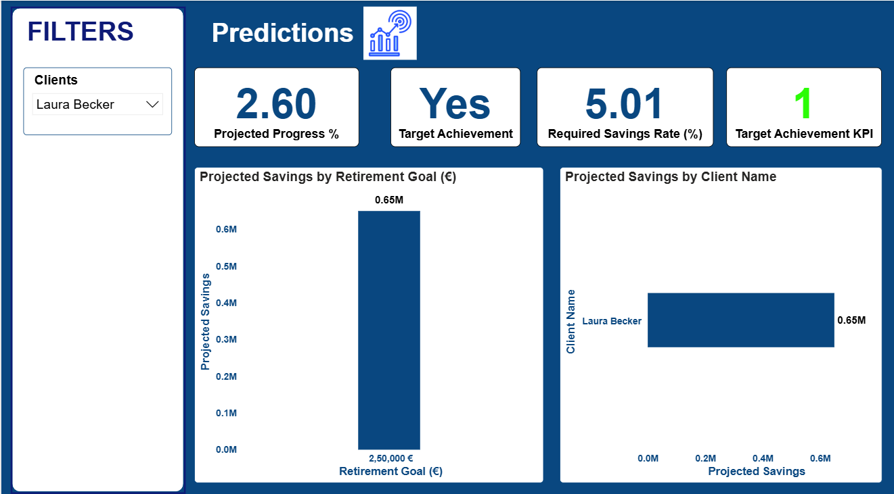

# Finance Dashboard - Power BI

This project is an **interactive Finance Dashboard** built in **Power BI**.  
It analyzes client financial data and predicts retirement goal achievement using DAX measures.

## 🔹 Features
- Client Net Worth, Income, Expenses, Assets vs Liabilities
- Retirement Progress % by client
- KPI: Projected Savings vs Retirement Goal
- Yes/No Target Achievement
- Required Savings Rate (%)
- What-If Scenarios (Retirement Age, Savings Rate)

#Power BI, #Dashboard, #Finance, #DAX, #Data Visualization
## 📸 Dashboard Preview

### Page 1 - Overview

### Page 2 - Predictions

Page 1 – Dashboard Overview

Total Clients, Net Worth, Coverage Gap, Average Age, Retirement Progress %

Breakdown of Net Worth per client

Retirement progress % by client

Income vs Expenses vs Goals in tabular format

Assets vs Liabilities distribution

🔹 Page 2 – Predictions

Projected Progress % → How close each client is to their retirement goal

Target Achievement (Yes/No) → Simple KPI to show if they’ll make it

Required Savings Rate → Minimum savings % needed to achieve the goal

Comparison of Projected Savings vs Retirement Goal

A slicer to explore results for each client

✨ Key Learnings

Using DAX to calculate future projections (Projected Savings, Progress %)

Creating KPI measures with clear indicators (Yes/No, 🟢/🔴 logic)

Adding What-if parameters for scenario analysis (retirement age, savings rate)

Designing a clean, business-ready dashboard layout
